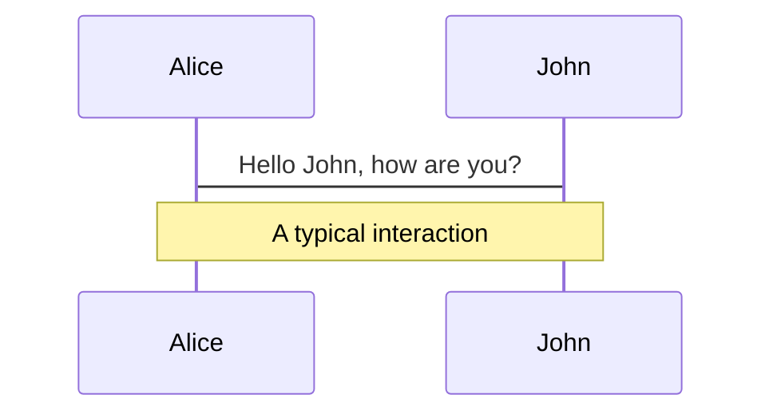
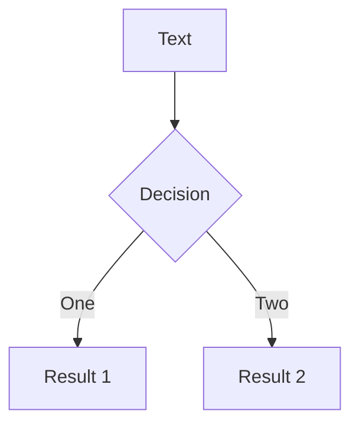
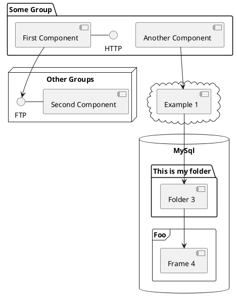

---
# try also 'default' to start simple
theme: seriph
# random image from a curated Unsplash collection by Anthony
# like them? see https://unsplash.com/collections/94734566/slidev
# background: https://source.unsplash.com/collection/94734566/1920x1080
# apply any windi css classes to the current slide
class: 'text-center'
# https://sli.dev/custom/highlighters.html
highlighter: shiki
# show line numbers in code blocks
lineNumbers: false
# some information about the slides, markdown enabled
info: |
  ## Slidev Starter Template
  Presentation slides for developers.

  Learn more at [Sli.dev](https://sli.dev)
# persist drawings in exports and build
drawings:
  persist: false
# use UnoCSS (experimental)
css: unocss
---

# Hello UniTrento

<!-- 
<div class="pt-12">
  <span @click="$slidev.nav.next" class="px-2 py-1 rounded cursor-pointer" hover="bg-white bg-opacity-10">
    Press Space for next page <carbon:arrow-right class="inline"/>
  </span>
</div> -->

<!--
The last comment block of each slide will be treated as slide notes. It will be visible and editable in Presenter Mode along with the slide. [Read more in the docs](https://sli.dev/guide/syntax.html#notes)
-->

---

# Where the ICP shines?

Slidev is a slides maker and presenter designed for developers, consist of the following features

- 📝 **High throughput** - focus on the content with Markdown, and then style them later
- 📝 **Cheap Storage and fees** - focus on the content with Markdown, and then style them later
- 🎨 **Horizontally scalable** - theme can be shared and used with npm packages
- 🧑‍💻 **Can host frontends** - code highlighting, live coding with autocompletion
- 🤹 **Threshold Encryption** - embedding Vue components to enhance your expressions

<br>

<style>
h1 {
  background-color: #2B90B6;
  background-image: linear-gradient(45deg, #4EC5D4 10%, #146b8c 20%);
  background-size: 100%;
  -webkit-background-clip: text;
  -moz-background-clip: text;
  -webkit-text-fill-color: transparent;
  -moz-text-fill-color: transparent;
}
</style>


---

# What is Motoko?

Slidev is a slides maker and presenter designed for developers, consist of the following features

- 📝 **Built at Dfinity by Andreas Rossberg** - focus on the content with Markdown, and then style them later
- 📝 **Strongly typed** - focus on the content with Markdown, and then style them later
- 🎨 **Garbage collected** - theme can be shared and used with npm packages
- 🧑‍💻 **Internet Computer first** - code highlighting, live coding with autocompletion
- 🤹 **Best of many worlds** - embedding Vue components to enhance your expressions

<br>

# Why Motoko?

Slidev is a slides maker and presenter designed for developers, consist of the following features

- 📝 **Easy to learn** - focus on the content with Markdown, and then style them later
- 🎨 **Thought for the Internet Computer** - theme can be shared and used with npm packages
- 🧑‍💻 **Fast and Safe** - code highlighting, live coding with autocompletion


<!--
You can have `style` tag in markdown to override the style for the current page.
Learn more: https://sli.dev/guide/syntax#embedded-styles
-->

<style>
h1 {
  background-color: #2B90B6;
  background-image: linear-gradient(45deg, #4EC5D4 10%, #146b8c 20%);
  background-size: 100%;
  -webkit-background-clip: text;
  -moz-background-clip: text;
  -webkit-text-fill-color: transparent;
  -moz-text-fill-color: transparent;
}
</style>

---

# Contents

Slidev is a slides maker and presenter designed for developers, consist of the following features

- 📝 **The actor model (.mo types)** - focus on the content with Markdown, and then style them later
- 🎨 **Motoko hello world** - theme can be shared and used with npm packages
- 🧑‍💻 **Basic Types** - code highlighting, live coding with autocompletion
- 🤹 **Abstract Types** - embedding Vue components to enhance your expressions
- 🎥 **Optional Types** - built-in recording and camera view
- 📤 **Variant Types** - export into PDF, PNGs, or even a hostable SPA
- 🛠 **Query and Update method** - anything possible on a webpage
- 🛠 **Stable Memory** - anything possible on a webpage
- 🛠 **Live Coding Session** - anything possible on a webpage
- 🛠 **Q&A** - anything possible on a webpage

<br>
<br>

<!--
You can have `style` tag in markdown to override the style for the current page.
Learn more: https://sli.dev/guide/syntax#embedded-styles
-->

<style>
h1 {
  background-color: #2B90B6;
  background-image: linear-gradient(45deg, #4EC5D4 10%, #146b8c 20%);
  background-size: 100%;
  -webkit-background-clip: text;
  -moz-background-clip: text;
  -webkit-text-fill-color: transparent;
  -moz-text-fill-color: transparent;
}
</style>

---

# Code

Use code snippets and get the highlighting directly![^1]

```ts {all|2|1-6|9|all}
interface User {
  id: number
  firstName: string
  lastName: string
  role: string
}

function updateUser(id: number, update: User) {
  const user = getUser(id)
  const newUser = { ...user, ...update }
  saveUser(id, newUser)
}
```

<arrow v-click="3" x1="400" y1="420" x2="230" y2="330" color="#564" width="3" arrowSize="1" />

[^1]: [Learn More](https://sli.dev/guide/syntax.html#line-highlighting)

<style>
.footnotes-sep {
  @apply mt-20 opacity-10;
}
.footnotes {
  @apply text-sm opacity-75;
}
.footnote-backref {
  display: none;
}
</style>

---

# Diagrams

You can create diagrams / graphs from textual descriptions, directly in your Markdown.

<div class="grid grid-cols-3 gap-10 pt-4 -mb-6">







</div>

[Learn More](https://sli.dev/guide/syntax.html#diagrams)


---
layout: center
class: text-center
---

# Learn More

[Documentations](https://sli.dev) · [GitHub](https://github.com/slidevjs/slidev) · [Showcases](https://sli.dev/showcases.html)
